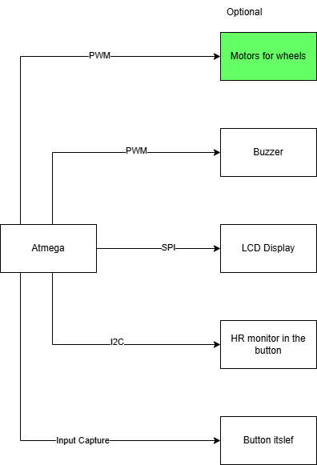
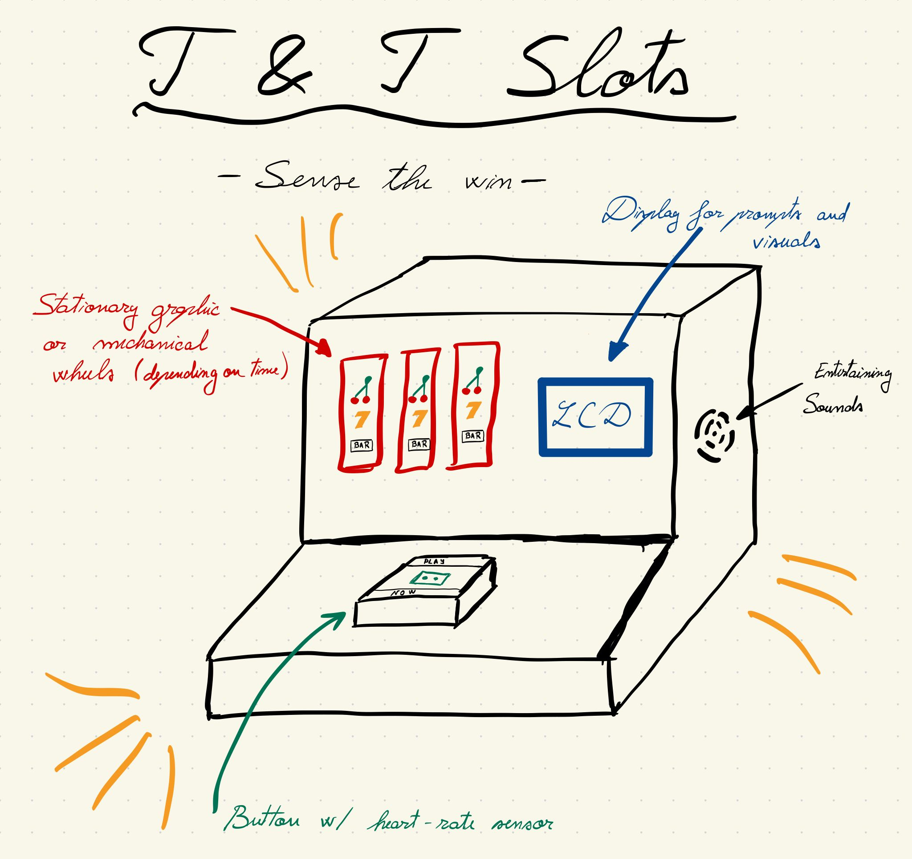
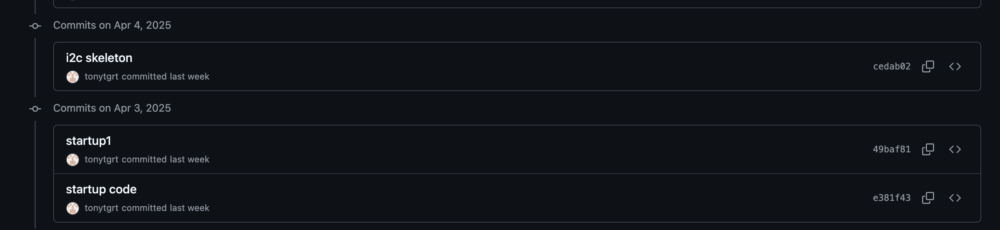
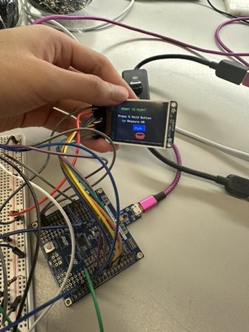
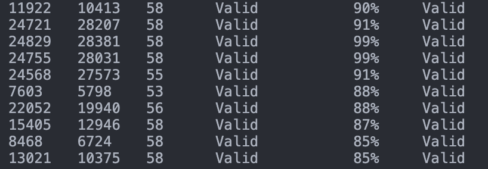
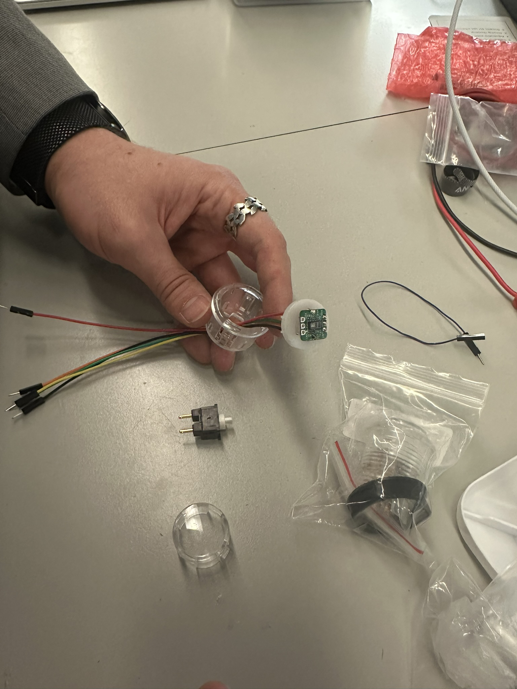

# final-project-skeleton

* Team Number: 6
* Team Name: T&T Slots - Sense the Win
* Team Members: Theodor Bulacovschi, Yiding Tian
* GitHub Repository URL: [https://github.com/upenn-embedded/final-project-s25-t-t-slots-sense-the-win](https://github.com/upenn-embedded/final-project-s25-t-t-slots-sense-the-win)
* GitHub Pages Website URL: [for final submission]

## Final Project Proposal

### 1. Abstract

*In a few sentences, describe your final project.*

Our project is an interactive chance-based gaming device that takes into account the player's vital signs to adjust the probability of winning, maximizing engagement and retention. In lay-man's terms, it's a slot machine that measures the user's pulse and changes the odds to keep them playing longer.

### 2. Motivation

*What is the problem that you are trying to solve? Why is this project interesting? What is the intended purpose?*

Considering the abundance of health-tracking initiatives, we thought of making a unique device, merging entertainment and bio-monitoring. This device would also be useful as a case study for the efficiency of variable-odds gaming devices, and the effects on the users.

### 3. System Block Diagram

*Show your high level design, as done in WS1 and WS2. What are the critical components in your system? How do they communicate (I2C?, interrupts, ADC, etc.)? What power regulation do you need?*

Motors for actual slot machine wheels are optional, and they would require extra power beyond what the AtMega can provide. However, their implementation would not be that difficult, considering the power circuitry already identified for WS1.

### 4. Design Sketches

*What will your project look like? Do you have any critical design features? Will you need any special manufacturing techniques to achieve your vision, like power tools, laser cutting, or 3D printing?*

### 5. Software Requirements Specification (SRS)

*Formulate key software requirements here. Think deeply on the design: What must your device do? How will you measure this during validation testing? Create 4 to 8 critical system requirements.*

*These must be testable! See the Final Project Manual Appendix for details. Refer to the table below; replace these examples with your own.*

**5.1 Definitions, Abbreviations**

Here, you will define any special terms, acronyms, or abbreviations you plan to use for hardware

HR - heart rate

**5.2 Functionality**

| ID     | Description                                                                                                                                                                                                                                                    |
| ------ | -------------------------------------------------------------------------------------------------------------------------------------------------------------------------------------------------------------------------------------------------------------- |
| SRS-01 | The ATmega shall continuously prompt the user to play, telling them to keep their hand pressing the button until the HR sensor establishes their pulse.                                                                                                         |
| SRS-02 | The HR sensor shall be measuring only while the button is pressed, to conceal its existance.                                                                                                                                                                   |
| SRS-03 | Upon button release, the ATmega shall change the odds in the following manner: if the HR is low, increase odds of winning to increase excitement, HR, and engagement. If HR is high, decrease odds to elongate play, build anticipation, and increase profits. |
| SRS-04 | The buzzer shall play varied exciting tunes, encouraging continued play, and shall react to game outcomes.                                                                                                                                                     |
| SRS-05 | If implemented, the wheels should begin spinning on button press, and sequentially stop after the button release, according to the game outcome.                                                                                                               |

### 6. Hardware Requirements Specification (HRS)

*Formulate key hardware requirements here. Think deeply on the design: What must your device do? How will you measure this during validation testing? Create 4 to 8 critical system requirements.*

*These must be testable! See the Final Project Manual Appendix for details. Refer to the table below; replace these examples with your own.*

**6.1 Definitions, Abbreviations**

Here, you will define any special terms, acronyms, or abbreviations you plan to use for hardware

**6.2 Functionality**

| ID     | Description                                                                                                                                                                                                  |
| ------ | ------------------------------------------------------------------------------------------------------------------------------------------------------------------------------------------------------------ |
| HRS-01 | A heart rate monitor shall be used for monitoring user vital signs. It should be able to measure HR in the range 50-180 BPM.                                                                                 |
| HRS-02 | A buzzer shall be able play various sound frequencies and patterns in a pleasant manner.                                                                                                                     |
| HRS-03 | A display shall be able to display prompts, information and potentially animations to the user.                                                                                                              |
| HRS-04 | A button shall be made big enough to conceal the HR sensor, while being transparent in the region required for measurements.                                                                                 |
| HRS-05 | If implemented, the motors spinning the slot wheels should have variable speed, make the clicking sounds specific to slot machines, and be able to stop at precises positions according to the game outcome. |

### 7. Bill of Materials (BOM)

*What major components do you need and why? Try to be as specific as possible. Your Hardware & Software Requirements Specifications should inform your component choices.*

*In addition to this written response, copy the Final Project BOM Google Sheet and fill it out with your critical components (think: processors, sensors, actuators). Include the link to your BOM in this section.*

[https://docs.google.com/spreadsheets/d/1qyvZnWI3Nq7rkF-FLIlKeIRL2Z1_xs5uF36gUQWZ2QY/edit?usp=sharing](https://docs.google.com/spreadsheets/d/1qyvZnWI3Nq7rkF-FLIlKeIRL2Z1_xs5uF36gUQWZ2QY/edit?usp=sharing)

### 8. Final Demo Goals

*How will you demonstrate your device on demo day? Will it be strapped to a person, mounted on a bicycle, require outdoor space? Think of any physical, temporal, and other constraints that could affect your planning.*

It will be on a table. We will have well-rested (calm heart rate) players play, then do jumping jacks to elevate the players heart rate and see the different effects on the outcomes of the slot machine.

### 9. Sprint Planning

*You've got limited time to get this project done! How will you plan your sprint milestones? How will you distribute the work within your team? Review the schedule in the final project manual for exact dates.*

| Milestone  | Functionality Achieved                                                   | Distribution of Work |
| ---------- | ------------------------------------------------------------------------ | -------------------- |
| Sprint #1  | Display prompts on LCD                                                   | 50%, details TBD     |
| Sprint #2  | Communicate over I2C with HR sensor                                      | 50%, details TBD     |
| MVP Demo   | Continuous HR values, Display game outcomes                              | 50%, details TBD     |
| Final Demo | HR monitor only when button is pressed, variable odds, animations, sound | 50%, details TBD     |

**This is the end of the Project Proposal section. The remaining sections will be filled out based on the milestone schedule.**

## Sprint Review #1

### Last week's progress
Just Started

### Current state of project
Wrote code for displaying prompts. Implemented the basic game stages and state machine. Designed GUI for the game. Drew animations on screen. 

### Next week's plan
Configure I2C connection of HR sensor. Figure out how to integrate the sensor with the button.

## Sprint Review #2

### Last week's progress
I2C testing on HR sensor mostly completed. Compatible buttons arrived. Worked on drilling holes and integrating the button with the sensor. 

### Current state of project
Close to MVP. HR sensor is configured on an individual profile. Button and sensor is about to get integrated together. 

### Next week's plan
Integrate the HR sensor driver code to the main game project. Integrate the button and sensor in hardware.

## MVP Demo

1. Show a system block diagram & explain the hardware implementation.

- Same diagram without the optional wheel part

- 

2. Explain your firmware implementation, including application logic and critical drivers you've written.

- We implemented our firmware with our own I2C driver explicitly for the MAX30102 heart rate sensor. We used the LCD driver library as implemented in Lab 4, and the uart library as provided before. The firmware measures the heartrate continuously, and sets up the game stages based on the button press. Different stages are outputted to the LCD screen along with different sound effects by the buzzer. 

3. Demo your device.

- Demoed to James
- 

4. Have you achieved some or all of your Software Requirements Specification (SRS)?
- Achieved all but the optional motor SRS-05 and the SRS-02: *The HR sensor shall be measuring only while the button is pressed, to conceal its existance*. This requirement had some oversight that since the LED on the sensor is always on it becomes irrelevent to try to conceal on the software level.
- Showed the data and outcome to James.

5. Have you achieved some or all of your Hardware Requirements Specification (HRS)?
- Achieved all but the optional motor HRS-05.
- Showed the data and outcome to James.

6. Show off the remaining elements that will make your project whole: mechanical casework, supporting graphical user interface (GUI), web portal, etc.
- Will get a new wooden panel for holding the button
- Will glue the enclosure together, but might keep the tapes as an aethetic feature.
- Will tune the GUI animations and the sound effects for better entertainment

7. What is the riskiest part remaining of your project?
- Getting the new panel
   1. How do you plan to de-risk this?
   - Finding a bettern cutting station than the RPL
8. What questions or help do you need from the teaching team?

## Final Project Report

Don't forget to make the GitHub pages public website!
If you’ve never made a GitHub pages website before, you can follow this webpage (though, substitute your final project repository for the GitHub username one in the quickstart guide):  [https://docs.github.com/en/pages/quickstart](https://docs.github.com/en/pages/quickstart)

### 1. Video

[Insert final project video here]

* The video must demonstrate your key functionality.
* The video must be 5 minutes or less.
* Ensure your video link is accessible to the teaching team. Unlisted YouTube videos or Google Drive uploads with SEAS account access work well.
* Points will be removed if the audio quality is poor - say, if you filmed your video in a noisy electrical engineering lab.

### 2. Images

[Insert final project images here]

*Include photos of your device from a few angles. If you have a casework, show both the exterior and interior (where the good EE bits are!).*

### 3. Results

*What were your results? Namely, what was the final solution/design to your problem?*

#### 3.1 Software Requirements Specification (SRS) Results

*Based on your quantified system performance, comment on how you achieved or fell short of your expected requirements.*

*Did your requirements change? If so, why? Failing to meet a requirement is acceptable; understanding the reason why is critical!*

*Validate at least two requirements, showing how you tested and your proof of work (videos, images, logic analyzer/oscilloscope captures, etc.).*

| ID     | Description                                                                                               | Validation Outcome                                                                          |
| ------ | --------------------------------------------------------------------------------------------------------- | ------------------------------------------------------------------------------------------- |
| SRS-01 | The IMU 3-axis acceleration will be measured with 16-bit depth every 100 milliseconds +/-10 milliseconds. | Confirmed, logged output from the MCU is saved to "validation" folder in GitHub repository. |

#### 3.2 Hardware Requirements Specification (HRS) Results

*Based on your quantified system performance, comment on how you achieved or fell short of your expected requirements.*

*Did your requirements change? If so, why? Failing to meet a requirement is acceptable; understanding the reason why is critical!*

*Validate at least two requirements, showing how you tested and your proof of work (videos, images, logic analyzer/oscilloscope captures, etc.).*

| ID     | Description                                                                                                                        | Validation Outcome                                                                                                      |
| ------ | ---------------------------------------------------------------------------------------------------------------------------------- | ----------------------------------------------------------------------------------------------------------------------- |
| HRS-01 | A distance sensor shall be used for obstacle detection. The sensor shall detect obstacles at a maximum distance of at least 10 cm. | Confirmed, sensed obstacles up to 15cm. Video in "validation" folder, shows tape measure and logged output to terminal. |
|        |                                                                                                                                    |                                                                                                                         |

### 4. Conclusion

Reflect on your project. Some questions to address:

* What did you learn from it?
* What went well?
* What accomplishments are you proud of?
* What did you learn/gain from this experience?
* Did you have to change your approach?
* What could have been done differently?
* Did you encounter obstacles that you didn’t anticipate?
* What could be a next step for this project?

## References

Fill in your references here as you work on your final project. Describe any libraries used here.
