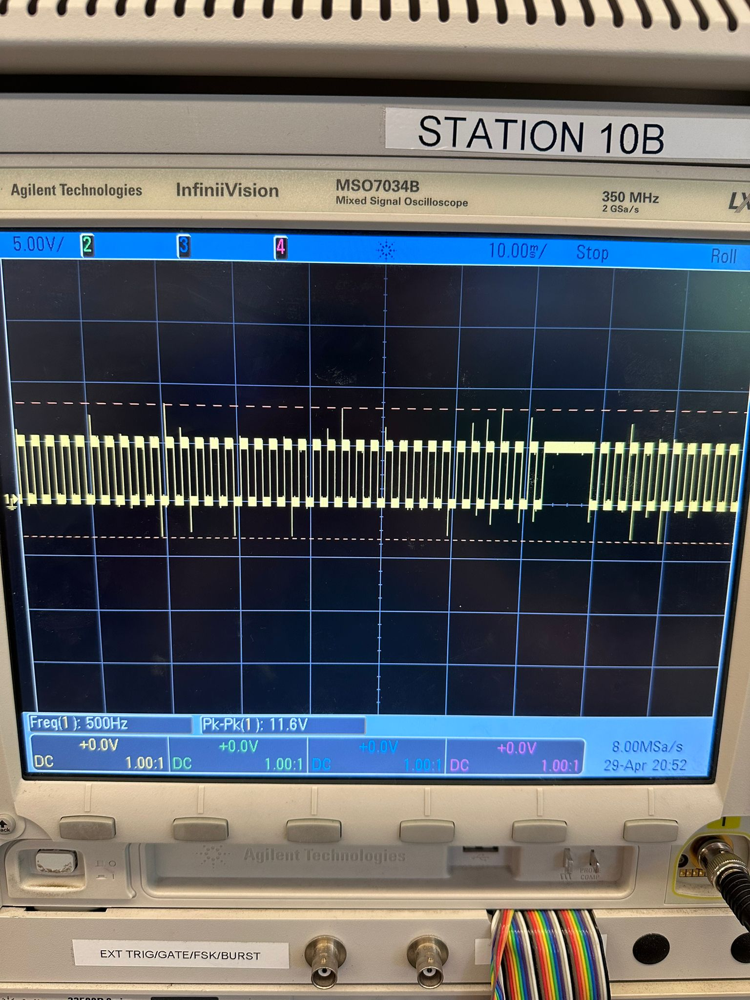

# Final Report

## Video



### Images

### SRS Validation

| ID     | Description                                                                                               | Validation Outcome                                                                          |
| ------ | --------------------------------------------------------------------------------------------------------- | ------------------------------------------------------------------------------------------- |
| SRS-01 | The ATmega shall continuously prompt the user to play, telling them to keep their hand pressing the button until the HR sensor establishes their pulse.    | Confirmed. The LCD display will show up a prompt screen when the sensor have not obtained a heart rate reading. |
| SRS-02 | The HR sensor shall be measuring only while the button is pressed, to conceal its existance |Deprecated for reliability. We also noticed during demo days that even though people knew the slot machine was unfair, and they saw their HR was measured constantly, they would still play. |                                                                                   
| SRS-03 | Upon button release, the ATmega shall change the odds in the following manner: if the HR is low, increase odds of winning to increase excitement, HR, and engagement. If HR is high, decrease odds to elongate play, build anticipation, and increase profits. | Confirmed. The determineWinOdds() function will change the odds accordingly and print winning odds to uart. See the code below. |
| SRS-04 | The buzzer shall play varied exciting tunes, encouraging continued play, and shall react to game outcomes. | Confirmed. The buzzer plays various exciting and engaging tones in different stages of gameplay. This can be seen in the video|
| SRS-05 | If implemented, the wheels should begin spinning on button press, and sequentially stop after the button release, according to the game outcome.| Not implemented. |

**SRS-03** :
```c
// Determine win odds based on heart rate
uint8_t determineWinOdds() {
    // Win logic according to SRS-03:
    // If HR is low, increase odds of winning
    // If HR is high, decrease odds to elongate play
    
    // Define heart rate thresholds
    #define LOW_HR_THRESHOLD 80
    #define HIGH_HR_THRESHOLD 120
    
    uint8_t winPercentage = 100;
    
    printf("HR used to determine odd: %u\n", heartRate);
    
    if (heartRate < LOW_HR_THRESHOLD) {
        // Low heart rate - guarantee win 
        winPercentage = 100;
    } else if (heartRate > HIGH_HR_THRESHOLD) {
        // High heart rate - lower odds (down to 5%)
        winPercentage = 20 - ((heartRate - HIGH_HR_THRESHOLD) / 10);
        if (winPercentage < 5) winPercentage = 5;
    } else {
        // Medium heart rate - medium odds (10-20%)
        winPercentage = 50 - ((heartRate - LOW_HR_THRESHOLD) / 2);
    }
    
    printf("Win odds: %u%%\r\n", winPercentage);
    return winPercentage;
}
```


Our final design satisfies most of our SRSs, with some omissions where the required timeline or user testing informed our decision to not implement certain extra features or stray from our initial thoughts of what the project should look like. Overall, our SRSs did help guide our progress, and this is definitely a technique we will use in future projects as well.

### HRS Validation

| ID     | Description                                                                                                                        | Validation Outcome                                                                                                      |
| ------ | ---------------------------------------------------------------------------------------------------------------------------------- | ----------------------------------------------------------------------------------------------------------------------- |
| HRS-01 |A heart rate monitor shall be used for monitoring user vital signs. It should be able to measure HR in the range 50-180 BPM. | Partly Confirmed. The sensor is able to measure HR at least 50-120 BPM. None of us took the slot machine to the gym with us to test the bounds.|
| HRS-02 | A buzzer shall be able play various sound frequencies and patterns in a pleasant manner. | Confirmed. The buzzer is able to play various sound. See pictures below |
| HRS-03 | A display shall be able to display prompts, information and potentially animations to the user. | Confirmed. The display is able to play prompts, results, and animations. See demo video. |
| HRS-04 | A button shall be made big enough to conceal the HR sensor, while being transparent in the region required for measurements. | Confirmed. A button is customly made to fit in the heart rate sensor, although not fulling concealling since the heart rate sensor can only work under transparent topping. See pictures.|
| HRS-05 | If implemented, the motors spinning the slot wheels should have variable speed, make the clicking sounds specific to slot machines, and be able to stop at precises positions according to the game outcome. | Not implemented. |

**HRS-01** - 

**HRS-02** - 

|  |  |  |  |  |
|:---: |:---: |:---: |:---: | :---: |
| 2kHz | 2.5kHz | Multiple Sounds | 3kHz | 500Hz |

**HRS-04** -

|  |  |
|:---: |:---: |
| Top view  | Side view  |

Our final design satisfies most of our HRSs, with only one omissions where the required timeline informed our decision to not implement certain extra features. Validation for certain numerical values also proved difficult because of biological constrains of healthy humans, but overall, our HRSs did help guide our progress, and this is definitely a technique we will use in future projects as well.

### Conclusions

**Tony:** I believe (...)

**Theodor:** My experience (...)

### References

* LCD SPI library for Lab 4, as implemented by Yiding Tian.
* UART library from UPenn Embedded

### Conclusion

Reflect on your project. Some questions to address:

* What did you learn from it?
   * I2C communication library writing.
   * Mechanical customization for tight hardware integration.
* What went well?
   * Pretty much everything.
* What accomplishments are you proud of?
   * Beautifully engineered button with integrated sensor.
* What did you learn/gain from this experience?
   * I2C communication library writing.
   * Mechanical customization for tight hardware integration.
* Did you have to change your approach?
   * No
* What could have been done differently?
   * The results could have been driven by motors and mechanical wheels if we had more time.
* Did you encounter obstacles that you didn’t anticipate?
   * No.
* What could be a next step for this project?
   * Find a way to integrate a mechanical wheel for the spinning.
